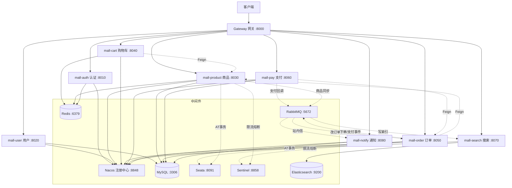

# 阿飞商城（afei-mall）

基于 **Spring Cloud Alibaba** 的微服务电商系统，覆盖「用户 → 商品 → 购物车 → 订单 → 支付 → 搜索 → 通知」完整购物链路，集成了服务注册发现、远程调用、网关、消息队列、分布式事务、分布式搜索等企业级中间件。

## 技术栈

| 分类 | 技术 | 版本 |
|------|------|------|
| 基础框架 | Spring Boot | 3.5.16 |
| 微服务 | Spring Cloud | 2024.0.2 |
| 微服务 | Spring Cloud Alibaba | 2023.0.1.2 |
| 语言 | Java | 17 |
| 注册中心 | Nacos | 2.5.2 |
| 远程调用 | OpenFeign + LoadBalancer | — |
| 网关 | Spring Cloud Gateway | — |
| 消息队列 | RabbitMQ | 3.8-management |
| 分布式事务 | Seata（AT 模式） | 1.8.0 |
| 限流熔断 | Sentinel | 1.8.6 |
| 分布式锁 | Redisson | 3.51.0 |
| 搜索引擎 | Elasticsearch | 7.17.29 |
| 缓存 | Redis | — |
| 数据库 | MySQL | 8.x |
| ORM | MyBatis-Plus | 3.5.15 |
| 鉴权 | JWT（jjwt） | 0.12.x |
| API 文档 | Knife4j + springdoc | 4.4.0 |

## 架构图



## 模块说明

| 模块 | 端口 | 职责 | 关键技术 |
|------|------|------|----------|
| mall-gateway | 8000 | 统一入口、路由转发、JWT 统一鉴权 | Spring Cloud Gateway + 全局过滤器 |
| mall-auth | 8010 | 登录注册、token 签发 | JWT + Redis |
| mall-user | 8020 | 用户信息管理 | MyBatis-Plus |
| mall-product | 8030 | 商品/品牌/分类/SKU、库存 | OSS 上传 + Redis 缓存 |
| mall-cart | 8040 | 购物车 | Redis 存储 |
| mall-order | 8050 | 订单、下单扣库存 | Seata 分布式事务 + Sentinel 限流 |
| mall-pay | 8060 | 支付、回调 | RabbitMQ 异步 |
| mall-search | 8070 | 商品搜索、搜索建议 | Elasticsearch |
| mall-notify | 8080 | 站内信通知 | 本地消息表可靠投递 |
| mall-common | — | 公共依赖（Result/Feign/MQ/JWT） | 各模块共享 |

## 核心业务流程

### 1. 下单（含分布式事务）

```
用户下单 → mall-order 创建订单 + 扣库存
                ↓
    @GlobalTransactional 开启全局事务
                ↓
    order 落库（RM1） + product 扣库存（RM2，Feign）
                ↓
    全部成功 → Seata 二阶段提交（PhaseTwo_Committed）
    任一失败 → 全局回滚（订单/库存同时回退）
```

### 2. 支付（含异步解耦）

```
发起支付 → mall-pay 生成支付单
    ↓
支付回调 → pay 发 MQ（order.paid.queue）
    ↓
mall-order 消费 → 订单状态 1→2（已付款）+ 支付时间
    ↓
order 发 MQ（notify.queue）→ mall-notify 生成"支付成功"站内信
```

### 3. 商品同步（含最终一致）

```
商品新增/上下架 → mall-product 发 MQ（spu.sync.queue）
    ↓
mall-search 消费 → 写入 ES 索引 spu
    ↓
GET /api/search/spu 关键词/品牌/价格区间搜索 + 高亮建议
```

### 4. 站内信（含可靠投递）

```
订单事件 → order 发 MQ（notify.queue）
    ↓
mall-notify 消费 → 写入 notify_record 本地消息表
    ↓
status=0 待发送 → 发送 → status=1 已发送 / status=2 失败
    ↓
定时任务扫 status=0 重试（retry_count 超阈值标记失败）
```

### 5. 订单超时自动关闭（含延迟队列）

```
下单成功 → order 发延迟消息（x-delay 30 分钟）
    ↓
30 分钟后消息投递到超时队列
    ↓
mall-order 消费 → 检查订单 status==1（待支付）
    ├─ 未支付 → 关单（status=6）+ Feign 回补库存 + 站内信通知
    └─ 已支付/已取消 → 忽略（幂等）
```

## 中间件依赖

| 中间件 | 地址 | 说明 |
|--------|------|------|
| Nacos | localhost:8848 | 服务注册与发现 |
| MySQL | localhost:3306 | 业务数据库（afei_user/product/order/pay/notify） |
| Redis | localhost:6379 | 购物车/缓存/登录态（密码 123456） |
| RabbitMQ | 192.168.100.128:5672 | 消息队列（af-mall/1234） |
| Seata | localhost:8091 | 分布式事务协调器（db 模式） |
| Sentinel | localhost:8858 | 限流熔断控制台（sentinel/sentinel） |
| Elasticsearch | 192.168.100.128:9200 | 商品搜索（7.17.29） |

## 快速开始

### 1. 环境准备

```bash
# 启动中间件
Nacos：本地启动（8848 端口）
MySQL：本地启动，导入各库建表 SQL
Redis：本地启动（6379，密码 123456）
RabbitMQ：docker run（VM 192.168.100.128）
Seata：本地启动 bin/seata-server.bat（8091）
Sentinel：本地启动 java -Dserver.port=8858 -jar sentinel-dashboard-1.8.6.jar
Elasticsearch：docker run（VM 192.168.100.128）
```

### 2. 构建

```bash
# 安装公共模块
mvn -pl mall-common -am install -DskipTests

# 或全量编译
mvn clean install -DskipTests
```

### 3. 启动顺序

```
1. Nacos / MySQL / Redis / RabbitMQ / Seata / ES（中间件）
2. mall-auth → mall-user → mall-product → mall-cart
3. mall-order → mall-pay → mall-search → mall-notify
4. mall-gateway（最后启动）
```

### 4. 验证

```bash
# 统一通过网关访问（8000）
POST /api/auth/login           # 登录拿 token
GET  /api/product/spu/page     # 商品列表
POST /api/cart                 # 加购物车
POST /api/order                # 下单（Seata 事务）
POST /api/pay                  # 支付
POST /api/pay/callback         # 支付回调（MQ）
GET  /api/search/spu?key=xx    # 搜索
GET  /api/notify/list          # 通知列表
```

## 核心亮点

1. **分布式事务**：下单 + 扣库存采用 Seata AT 模式，两阶段提交保证跨服务数据一致性
2. **异步解耦**：支付回调、商品同步、站内信均通过 RabbitMQ 异步处理，削峰解耦；订单超时自动关闭基于延迟队列（x-delayed-message）
3. **可靠消息投递**：站内信基于本地消息表（notify_record），支持失败重试，保证最终一致
4. **分布式搜索**：商品数据通过 MQ 同步到 Elasticsearch，支持关键词搜索 + 自动补全
5. **统一网关 + 统一鉴权**：Gateway 统一入口、路由转发、跨域处理；全局过滤器统一校验 JWT、白名单放行（登录/注册），解析后透传 `X-User-Id`/`X-User-Role` 给下游，鉴权逻辑从 8 个服务收口到网关一处
6. **缓存优化**：分类树、购物车、登录态使用 Redis 缓存，减少 DB 压力
7. **库存防超卖**：Redisson 分布式锁（看门狗自动续期）+ 原子 SQL 扣减（`stock >= num` 兜底），双重保障并发安全
8. **限流熔断**：Sentinel 对下单接口做 QPS 限流，`@SentinelResource` + `blockHandler` 自定义降级返回友好提示
9. **订单超时自动关闭**：下单后发延迟消息（x-delayed-message），30 分钟未支付自动关单 + 回补库存
